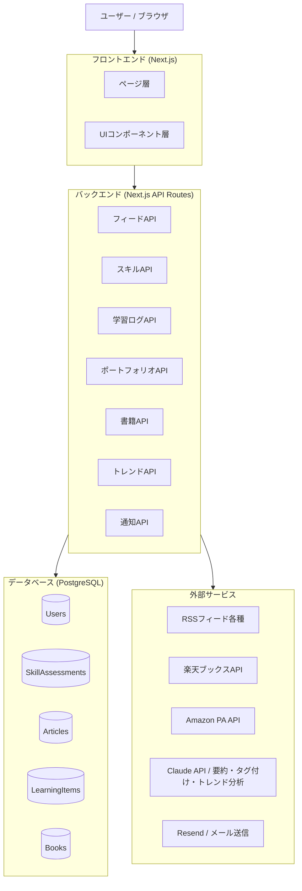
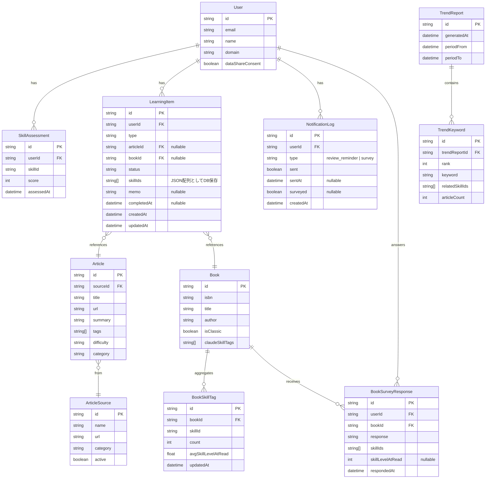
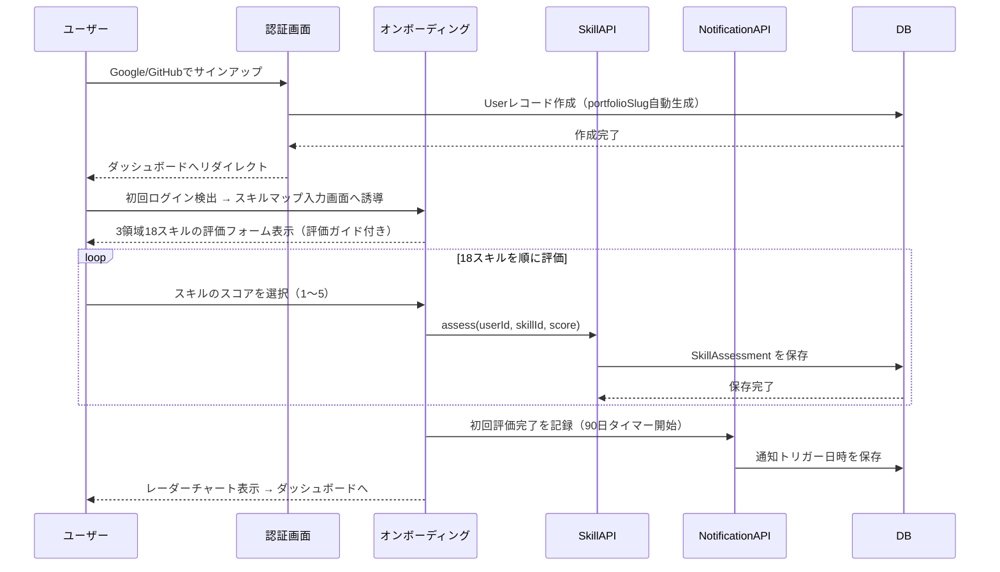
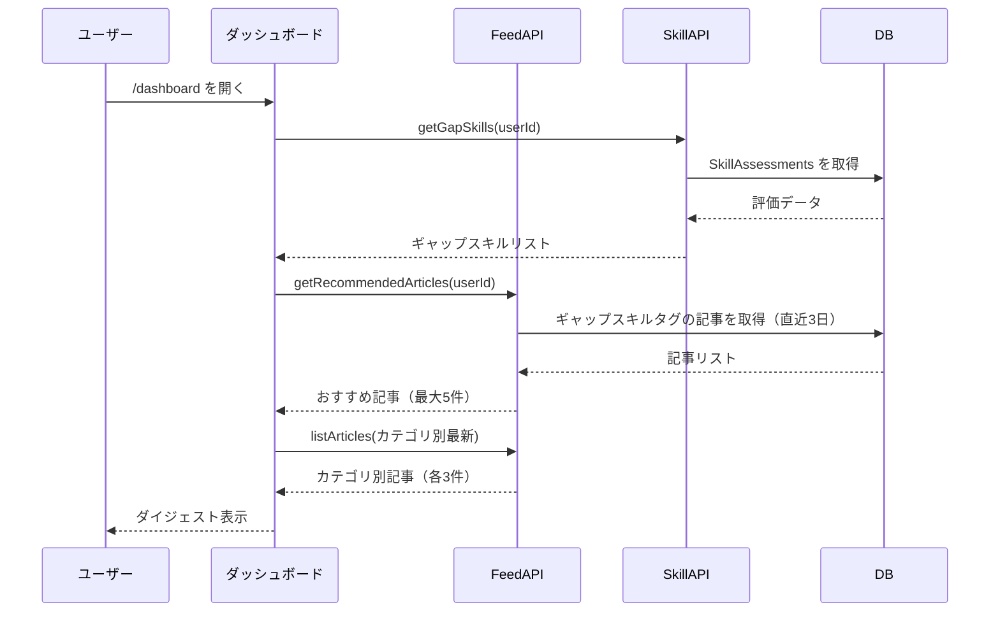
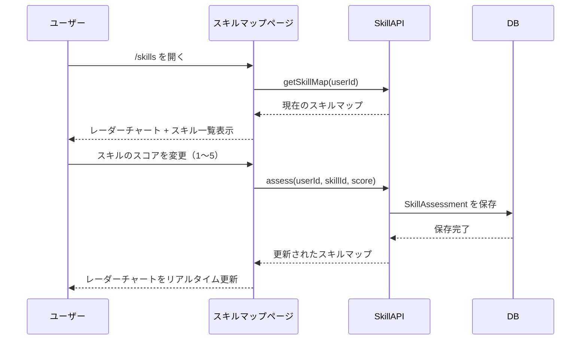
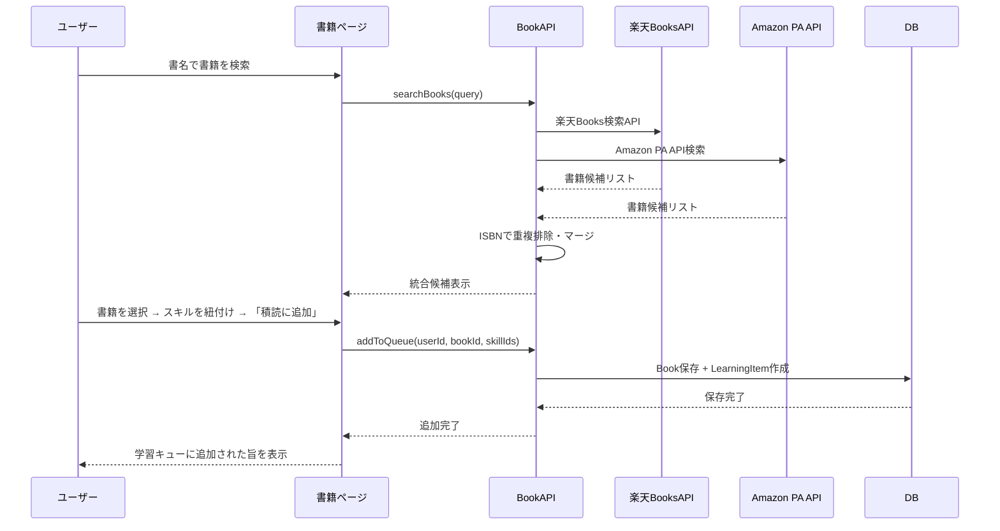
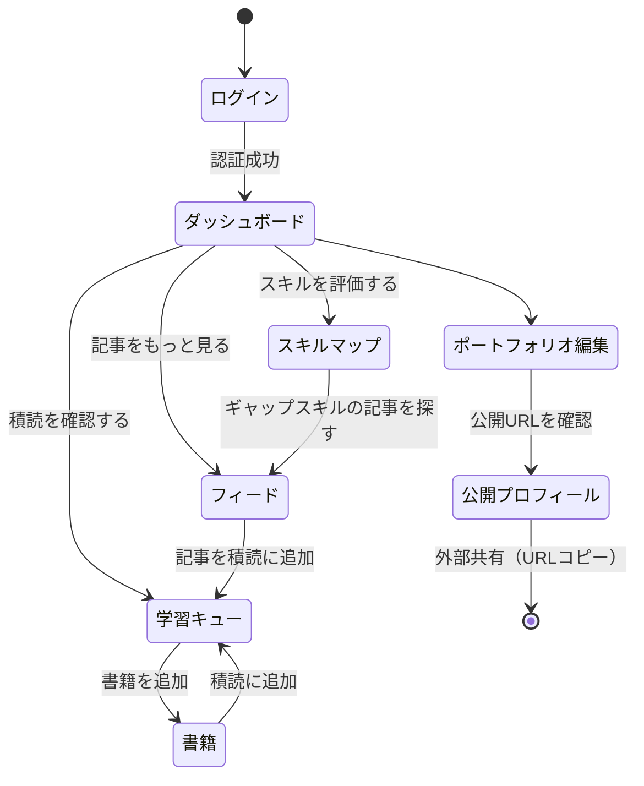

# 機能設計書 (Functional Design Document)

## システム構成図



---

## 技術スタック

| 分類 | 技術 | 選定理由 |
|------|------|----------|
| フロントエンド | Next.js (React) | SSR対応・モバイルファースト・TypeScript親和性 |
| バックエンド | Next.js API Routes | フロントと同一リポジトリで管理しやすい |
| データベース | PostgreSQL + Prisma | リレーショナルデータに適合・型安全なORM |
| 認証 | NextAuth.js | Google/GitHub OAuth対応・セッション管理 |
| スタイル | Tailwind CSS | モバイルファースト設計・高速開発 |
| 外部API連携 | 楽天ブックスAPI + Amazon PA API / RSSパーサー | 書籍ランキング・書誌情報・記事収集 |
| AI処理 | Claude API | 記事要約・スキルタグ付け・難易度タグ付け自動化 |
| ホスティング | Vercel | Next.jsとの相性・デプロイ簡易 |

---

## データモデル定義

### エンティティ: User

```typescript
interface User {
  id: string;            // UUID
  email: string;         // メールアドレス（ユニーク）
  name: string;          // 表示名
  bio?: string;          // 自己紹介（200文字以内）
  domain: Domain;        // 専門領域（初期は 'people_analytics_od' 固定）
  dataShareConsent: boolean; // 学習行動データの集合知利用への同意フラグ（デフォルト false）
                             // P2「他のHRプロとの匿名比較」機能で使用
                             // true のユーザーの匿名集計データのみ協調フィルタリングに利用する
  createdAt: Date;
  updatedAt: Date;
}

type Domain = 'people_analytics_od'; // 将来的に拡張
```

---

### エンティティ: SkillAssessment（スキル自己評価）

```typescript
interface SkillAssessment {
  id: string;
  userId: string;        // FK -> User
  skillId: SkillId;      // スキル識別子（後述の定数から選択）
  score: 1 | 2 | 3 | 4 | 5;  // 自己評価スコア
  assessedAt: Date;      // 評価日時
  note?: string;         // 評価メモ（任意）
}

// スキルマスタ（コードで管理）
const SKILL_FRAMEWORK = {
  people_analytics: [
    { id: 'data_literacy',           label: 'データリテラシー' },
    { id: 'hr_metrics',              label: 'HRメトリクス設計・分析' },
    { id: 'data_visualization',      label: 'データビジュアライゼーション・ストーリーテリング' },
    { id: 'survey_design',           label: 'サーベイ設計・分析' },
    { id: 'hris_tech',               label: 'HRIS・HRテクノロジー活用' },
    { id: 'workforce_planning',      label: '予測分析・ワークフォースプランニング' },
    { id: 'causal_inference',        label: '因果推論' },
    { id: 'factor_analysis',         label: '要因分析' },
  ],
  organizational_development: [
    { id: 'org_diagnosis',           label: '組織診断・アセスメント' },
    { id: 'change_management',       label: 'チェンジマネジメント' },
    { id: 'facilitation',            label: 'ファシリテーション・介入設計' },
    { id: 'culture_engagement',      label: 'カルチャー・エンゲージメント' },
    { id: 'ld_design',               label: 'L&D設計' },
    { id: 'stakeholder_mgmt',        label: 'ステークホルダーマネジメント' },
  ],
  strategic_hr: [
    { id: 'evidence_based_hr',       label: 'エビデンスベースドHR' },
    { id: 'org_effectiveness',       label: '組織有効性の測定・改善' },
    { id: 'employee_listening',      label: 'エンプロイーリスニング戦略' },
    { id: 'people_strategy',         label: '人材戦略・経営への提言' },
  ],
} as const;

type SkillId = typeof SKILL_FRAMEWORK[keyof typeof SKILL_FRAMEWORK][number]['id'];
```

---

### エンティティ: Article（収集記事）

```typescript
interface Article {
  id: string;
  sourceId: string;      // FK -> ArticleSource
  title: string;
  url: string;           // 元記事URL（ユニーク）
  summary: string;       // Claude APIで生成した日本語要約（100-200字）
  publishedAt: Date;     // 元記事の公開日
  tags: SkillId[];       // 関連スキルタグ（Claude APIで自動付与）
  difficulty: ArticleDifficulty; // 難易度タグ（Claude APIで自動付与）
  category: ArticleCategory;
  fetchedAt: Date;       // 取得日時
}

type ArticleCategory =
  | 'people_analytics'
  | 'organizational_development'
  | 'hr_tech'
  | 'domestic_hr'
  | 'management_science'
  | 'labor_economics'
  | 'academic_global'
  | 'academic_domestic'
  | 'hr_consulting_global'
  | 'hr_consulting_domestic';

type ArticleDifficulty = 'beginner' | 'practical' | 'advanced' | 'expert';

interface ArticleSource {
  id: string;
  name: string;          // ソース名（例: "Josh Bersin"）
  url: string;           // RSSフィードURL
  category: ArticleCategory;
  active: boolean;       // 取得有効フラグ
}

// 初期データ（シードデータ）
// 10カテゴリ・34ソースの定義は docs/product-requirements.md「キュレーション情報フィード > プリセット情報ソース」を参照
// DBマイグレーション時に prisma/seed.ts からシードデータとして投入する
```

---

### エンティティ: LearningItem（学習ログ）

```typescript
interface LearningItem {
  id: string;
  userId: string;        // FK -> User
  type: 'article' | 'book';
  articleId?: string;    // type === 'article' の場合 FK -> Article
  bookId?: string;       // type === 'book' の場合 FK -> Book
  status: 'queued' | 'completed';  // 積読 or 読了
  skillIds: SkillId[];   // 紐付けスキル（1つ以上）
  memo?: string;         // 読了メモ（任意・Markdown）
  completedAt?: Date;    // 読了日時
  createdAt: Date;
  updatedAt: Date;
}
```

---

### エンティティ: Book（書籍）

```typescript
interface Book {
  id: string;
  isbn: string;            // ISBN（ユニーク）
  title: string;
  author: string;
  publisher: string;
  publishedDate: string;   // YYYY-MM形式
  imageUrl?: string;       // 書影URL
  rakutenItemCode?: string; // 楽天商品コード
  amazonAsin?: string;     // Amazon ASIN
  isClassic: boolean;      // 名著フラグ（毎日アンケート対象・デフォルト false）
  claudeSkillTags: SkillId[]; // Claude APIが事前付与したスキルタグ（フェーズ1で使用）
  createdAt: Date;
}
```

---

### エンティティ: NotificationLog（通知ログ）

```typescript
interface NotificationLog {
  id: string;
  userId: string;          // FK -> User
  type: 'review_reminder' | 'survey'; // 通知種別
                           // review_reminder: 棚卸しリマインダー（メール + バナー）
                           // survey: 成長実感アンケート表示
  sent: boolean;           // メール送信済みフラグ
  sentAt?: Date;           // 送信日時（nullable）
  surveyed?: boolean;      // アンケート回答済みフラグ（nullable・survey typeのみ使用）
  createdAt: Date;
}
```

---

### エンティティ: TrendReport / TrendKeyword（トレンドレポート）

```typescript
interface TrendReport {
  id: string;
  generatedAt: Date;       // レポート生成日時
  periodFrom: Date;        // 分析対象期間（開始）
  periodTo: Date;          // 分析対象期間（終了）
}

interface TrendKeyword {
  id: string;
  trendReportId: string;   // FK -> TrendReport
  rank: number;            // 順位（1〜10）
  keyword: string;         // トレンドキーワード
  relatedSkillIds: SkillId[]; // 関連スキルID（Claude APIが対応付け）
  articleCount: number;    // このキーワードに関連する記事数（分析期間内）
}
// TrendSkillMapping（スキルマップとの対応関係）はDB非保存のビューモデル
// TrendService.getSkillMapping() がTrendKeyword + SkillAssessmentから動的生成する
```

---

### エンティティ: BookSkillTag（書籍スキルタグ集計）

```typescript
interface BookSkillTag {
  id: string;
  bookId: string;          // FK -> Book
  skillId: SkillId;        // 集計対象スキル
  count: number;           // このスキルタグを付与した回答数
  avgSkillLevelAtRead: number; // 回答者の読書当時スキルレベルの平均（1〜5）
  updatedAt: Date;         // 集計更新日時
}
// 参照ルール: Book.claudeSkillTags（回答数10件未満）or BookSkillTag集計（10件以上）
```

---

### エンティティ: BookSurveyResponse（毎日書籍アンケート回答）

```typescript
interface BookSurveyResponse {
  id: string;
  userId: string;          // FK -> User
  bookId: string;          // FK -> Book
  response: 'read' | 'queued' | 'skipped'; // 読んだ・積読に追加・スキップ
  skillIds: SkillId[];     // 「読んだ」選択時に紐付けたスキル（任意・複数）
  skillLevelAtRead?: number; // 「読んだ」選択時の読書当時スキルレベル（1〜5）
  respondedAt: Date;
}
```

---

### ER図



---

## コンポーネント設計

### フロントエンド: ページ構成

| ページ | パス | 優先度 | 説明 |
|---|---|---|---|
| ダッシュボード | `/dashboard` | P0 | 今日のフィード + スキルマップサマリー |
| スキルマップ | `/skills` | P0 | スキル自己評価・一覧・レーダーチャート |
| 情報フィード | `/feed` | P0 | 記事一覧・カテゴリフィルター |
| 学習キュー | `/learning` | P1 | 積読・読了管理 |
| 書籍 | `/books` | P1 | 書籍検索・ランキング・読書ログ・名著スキル評価 |
| ポートフォリオ | `/portfolio` | P1 | スキル・学習ログ・読書記録の個人振り返りダッシュボード |
| トレンドレーダー | `/trend` | P1 | HR領域のトレンドキーワード + スキルマップとの対応 |

---

### バックエンド: APIコンポーネント

#### FeedService（記事フィード管理）[P0 - MVP必須]

**責務**:
- RSSフィードの定期取得（1日1回 Cron）
- Claude APIによる記事要約・スキルタグ付け・難易度タグ付け
- カテゴリ・スキルタグ・難易度でのフィルタリング

```typescript
class FeedService {
  // RSSから記事を取得・保存
  fetchAndSaveArticles(): Promise<number>;  // 保存件数を返す

  // ユーザーのスキルギャップに基づくおすすめ記事取得
  getRecommendedArticles(userId: string, limit: number): Promise<Article[]>;

  // カテゴリ・タグでフィルタリングした記事一覧
  listArticles(filter: ArticleFilter): Promise<Article[]>;
}

interface ArticleFilter {
  category?: ArticleCategory;
  skillIds?: SkillId[];
  difficulty?: ArticleDifficulty;
  dateFrom?: Date;
  page: number;
  perPage: number;  // デフォルト 20
}
```

---

#### SkillService（スキル管理）[P0 - MVP必須]

**責務**:
- スキル自己評価の記録・取得
- スキルマップ集計（領域平均・ギャップ算出）
- 3ヶ月棚卸しリマインダー判定

```typescript
class SkillService {
  // スキルを自己評価・更新
  assess(userId: string, skillId: SkillId, score: 1 | 2 | 3 | 4 | 5, note?: string): Promise<SkillAssessment>;

  // 最新のスキルマップを取得
  getSkillMap(userId: string): Promise<SkillMap>;

  // ギャップスキル（スコア2以下）を取得
  // 閾値: DOMAIN_CONSTANTS.GAP_THRESHOLD = 2（src/constants/DOMAIN_CONSTANTS.ts）
  getGapSkills(userId: string): Promise<SkillId[]>;

  // 棚卸しリマインダーが必要か判定（最終評価から90日以上経過）
  // 閾値: DOMAIN_CONSTANTS.REVIEW_INTERVAL_DAYS = 90（src/constants/DOMAIN_CONSTANTS.ts）
  needsReview(userId: string): Promise<boolean>;
}

interface SkillMap {
  userId: string;
  assessments: Record<SkillId, { score: number; assessedAt: Date }>;
  domainAverages: {
    people_analytics: number;
    organizational_development: number;
    strategic_hr: number;
  };
  lastAssessedAt: Date;
}
```

---

#### LearningService（学習ログ管理）[P1]

**責務**:
- 記事・書籍の学習キュー登録・ステータス更新
- スキルとの紐付け管理
- 学習サマリー集計

```typescript
class LearningService {
  // 学習キューに追加
  addToQueue(userId: string, item: CreateLearningItemInput): Promise<LearningItem>;

  // 読了に更新
  markAsCompleted(userId: string, id: string, memo?: string): Promise<LearningItem>;

  // 学習ログ一覧（ステータス・スキルでフィルター可）
  listItems(userId: string, filter: LearningFilter): Promise<LearningItem[]>;

  // 月別・スキル別の学習量サマリー
  getSummary(userId: string): Promise<LearningSummary>;
}

interface LearningSummary {
  totalArticles: number;          // 読了記事数（全期間）
  totalBooks: number;             // 読了書籍数（全期間）
  totalMemos: number;             // 振り返りメモ数（全期間）
  recentSkills: SkillId[];        // 直近3ヶ月に注力したスキル（Top3）
  byMonth: {
    month: string;                // "YYYY-MM" 形式
    articleCount: number;
    bookCount: number;
  }[];
  bySkill: {
    skillId: SkillId;
    count: number;
  }[];
}
```

---

#### PortfolioService（個人振り返りダッシュボード管理）[P1]

**責務**:
- スキルマップ・学習ログ・読書記録を集約した個人ダッシュボードデータの生成

```typescript
class PortfolioService {
  // ポートフォリオデータ生成（スキルマップ + 学習サマリーを集約）
  generatePortfolio(userId: string): Promise<PortfolioData>;

  // 公開スラッグでポートフォリオ取得（認証不要）
  getPublicPortfolio(slug: string): Promise<PortfolioData>;

  // 公開/非公開切り替え
  togglePublic(userId: string, isPublic: boolean): Promise<void>;
}

interface PortfolioData {
  user: Pick<User, 'name' | 'bio' | 'portfolioSlug'>;
  skillMap: SkillMap;
  learningSummary: {
    totalArticles: number;     // 読了記事数
    totalBooks: number;        // 読了書籍数
    totalMemos: number;        // 振り返りメモ数
    recentSkills: SkillId[];   // 直近3ヶ月に注力したスキル（Top3）
  };
  updatedAt: Date;
}
```

---

#### BookService（書籍管理）[P1]

**責務**:
- 楽天Books API・Amazon PA APIによる書籍検索・書誌情報取得
- ISBNによる重複排除・データマージ
- 書店ランキングの週次取得

```typescript
class BookService {
  // 書名・著者でマルチソース検索（楽天 + Amazon、ISBNで重複排除）
  searchBooks(query: string): Promise<Book[]>;

  // ISBNで書籍を取得または新規保存
  findOrCreateByIsbn(isbn: string): Promise<Book>;

  // 楽天ブックスAPIからHR関連書籍ランキングを週次取得・保存
  fetchAndSaveRanking(): Promise<number>;  // 保存件数を返す

  // スキルマップのギャップと照合したおすすめ書籍
  getRecommendedBooks(userId: string, limit: number): Promise<Book[]>;
}
```

---

#### TrendService（トレンドレーダー管理）[P1]

**責務**:
- 収集済み記事データをClaude APIで分析し月次トレンドキーワードを生成
- 直近2ヶ月のローリングウィンドウで分析（前月 + 当月）
- トレンドキーワードとスキルマップの対応関係を算出

```typescript
class TrendService {
  // 月次バッチ: 直近2ヶ月の記事を分析してトレンドキーワードTop10を生成・保存
  generateMonthlyTrends(): Promise<TrendReport>;

  // 最新のトレンドレポートを取得
  getLatestTrends(): Promise<TrendReport>;

  // トレンドキーワードとユーザーのスキルマップの対応関係を取得
  getSkillMapping(userId: string, trendId: string): Promise<TrendSkillMapping[]>;
}

interface TrendReport {
  id: string;
  generatedAt: Date;
  periodFrom: Date;   // 分析対象期間の開始
  periodTo: Date;     // 分析対象期間の終了
  keywords: TrendKeyword[];
}

interface TrendKeyword {
  rank: number;           // 1〜10
  keyword: string;        // トレンドキーワード
  relatedSkillIds: SkillId[];  // 対応するスキルID
  articleCount: number;   // 関連記事数
}

interface TrendSkillMapping {
  skillId: SkillId;
  userScore: number;       // ユーザーの現在スコア
  isGap: boolean;          // スコア2以下でギャップ判定
}
```

---

#### NotificationService（通知管理）[P0 - MVP必須]

**責務**:
- スキル棚卸しリマインダーの送信判定
- Resendを使ったメール送信
- ダッシュボードバナー表示フラグの管理

```typescript
class NotificationService {
  // 棚卸しリマインダーが必要なユーザーにメール送信（Cron: 日次実行）
  sendReviewReminders(): Promise<number>;  // 送信件数を返す

  // ダッシュボードバナー表示フラグを取得（最終評価から90日以上経過かつ未回答）
  getBannerStatus(userId: string): Promise<NotificationBannerStatus>;

  // アンケート回答済みとして記録
  markSurveyed(userId: string): Promise<void>;
}

interface NotificationBannerStatus {
  showReviewBanner: boolean;   // 棚卸しリマインダーバナーを表示するか
  showSurveyBanner: boolean;   // スキル言語化アンケートを表示するか（90日後）
}
```

---

## ユースケース図

### UC-0: 初回オンボーディング（登録 → スキルマップ完成）



---

### UC-1: 今日のダイジェスト確認



---

### UC-2: スキル自己評価



---

### UC-3: 読書ログ登録



---

## 画面遷移図



---

## API設計

### スキル評価

```
POST /api/skills/assess
```

**認証**: 必須

**リクエスト**:
```json
{
  "skillId": "causal_inference",
  "score": 3,
  "note": "基礎は理解、実務でA/Bテスト設計まで対応できる"
}
```

**レスポンス**:
```json
{
  "id": "uuid",
  "skillId": "causal_inference",
  "score": 3,
  "assessedAt": "2026-03-23T09:00:00Z"
}
```

---

```
GET /api/skills/map
```

**認証**: 必須

**レスポンス**:
```json
{
  "assessments": {
    "data_literacy": { "score": 5, "assessedAt": "2026-03-01T00:00:00Z" },
    "causal_inference": { "score": 3, "assessedAt": "2026-03-23T09:00:00Z" }
  },
  "domainAverages": {
    "people_analytics": 3.8,
    "organizational_development": 3.2,
    "strategic_hr": 3.5
  },
  "needsReview": false
}
```

---

### 学習ログ

```
POST /api/learning
```

**認証**: 必須

**リクエスト**:
```json
{
  "type": "book",
  "bookId": "uuid",
  "skillIds": ["causal_inference", "hr_metrics"],
  "status": "queued"
}
```

---

```
PATCH /api/learning/:id/complete
```

**認証**: 必須

**リクエスト**:
```json
{
  "memo": "因果推論の基礎が理解できた。差分の差分法を実務で試したい。"
}
```

---

### 公開ポートフォリオ

```
GET /api/public/portfolio/:slug
```

**認証**: 不要（公開エンドポイント）

**レスポンス**:
```json
{
  "user": {
    "name": "山田 太郎",
    "bio": "People Analytics × 組織開発を専門とするHR担当者"
  },
  "skillMap": { ... },
  "learningSummary": {
    "totalArticles": 87,
    "totalBooks": 12,
    "totalMemos": 34,
    "recentSkills": ["causal_inference", "org_diagnosis", "evidence_based_hr"]
  },
  "updatedAt": "2026-03-23T00:00:00Z"
}
```

---

## アルゴリズム設計

### おすすめ記事スコアリング

ユーザーのスキルギャップと記事タグの一致度からスコアを計算し、優先表示する。

**計算ロジック**:

#### ステップ1: ギャップスコア（0〜100点）
スキルスコアが低いほど記事の優先度を上げる。

```typescript
function calcGapScore(skillScore: number): number {
  // スコア1 → 100点、スコア5 → 0点
  return (5 - skillScore) * 25;
}
```

#### ステップ2: 鮮度スコア（0〜100点）
```typescript
function calcFreshnessScore(publishedAt: Date): number {
  const daysOld = Math.floor((Date.now() - publishedAt.getTime()) / 86400000);
  if (daysOld <= 1)  return 100;
  if (daysOld <= 3)  return 80;
  if (daysOld <= 7)  return 60;
  if (daysOld <= 14) return 40;
  return 20;
}
```

#### ステップ3: 総合スコア
```typescript
// SkillService.getSkillMap() の結果を元にスコアを参照するヘルパー
function buildSkillScoreLookup(skillMap: SkillMap): (skillId: SkillId) => number {
  return (skillId: SkillId) => skillMap.assessments[skillId]?.score ?? 1;
}

function calcArticleScore(
  article: Article,
  gapSkills: SkillId[],
  getUserSkillScore: (skillId: SkillId) => number  // buildSkillScoreLookup() で生成
): number {
  const matchingSkills = article.tags.filter(tag => gapSkills.includes(tag));
  if (matchingSkills.length === 0) return 0;

  const avgGapScore = matchingSkills.reduce((sum, skillId) => {
    const userScore = getUserSkillScore(skillId); // 1〜5
    return sum + calcGapScore(userScore);
  }, 0) / matchingSkills.length;

  const freshnessScore = calcFreshnessScore(article.publishedAt);

  return (avgGapScore * 0.7) + (freshnessScore * 0.3);
}
```

---

## Claude API 入出力仕様

### 1. 記事要約・スキルタグ付け（FeedService）

**呼び出しタイミング**: RSS記事取得時（日次Cron）
**想定トークン数**: 1記事あたり約500トークン（入力400 + 出力100）

**プロンプト**:
```
以下の記事タイトルと本文（先頭800字）を読み、次の3つを返してください。
1. 日本語要約（100〜200字）
2. 関連するスキルタグ（以下のスキルIDリストから1〜3個選択）
3. 難易度タグ（以下の定義から1つ選択）

スキルIDリスト: data_literacy, hr_metrics, data_visualization, survey_design,
hris_tech, workforce_planning, causal_inference, factor_analysis,
org_diagnosis, change_management, facilitation, culture_engagement,
ld_design, stakeholder_mgmt, evidence_based_hr, org_effectiveness,
employee_listening, people_strategy

難易度定義:
- beginner: 概念解説・用語紹介・入門ブログ（スキルレベル1〜2向け）
- practical: 実務事例・How-to・ケーススタディ（スキルレベル2〜3向け）
- advanced: 深掘り分析・研究紹介・専門メディア（スキルレベル3〜4向け）
- expert: 学術論文・最新研究・エキスパート論考（スキルレベル4〜5向け）

記事タイトル: {{title}}
記事本文: {{body}}
```

**レスポンス（JSON）**:
```json
{
  "summary": "People Analyticsにおける予測モデルの精度向上手法を解説。機械学習モデルの選択基準と実務での検証方法を具体的に紹介している。",
  "tags": ["workforce_planning", "causal_inference"],
  "difficulty": "advanced"
}
```

---

### 2. 月次トレンドキーワード生成（TrendService）

**呼び出しタイミング**: 月次Cron（直近2ヶ月分の記事タイトル・タグを一括送信）
**想定トークン数**: 1回あたり約3,000〜5,000トークン

**プロンプト**:
```
以下はHR領域の記事データ（タイトルとスキルタグ）です。
直近2ヶ月（{{periodFrom}} 〜 {{periodTo}}）に収集した{{count}}件の記事を分析し、
HR領域のトレンドキーワードTop10を抽出してください。

条件:
- キーワードは具体的なHRの概念・技術・手法であること
- 各キーワードに対応するスキルIDを1〜3個付与すること
- 記事データの頻出テーマ・注目度を反映すること

記事データ:
{{articles}}  // [{title, tags}] の配列
```

**レスポンス（JSON）**:
```json
{
  "keywords": [
    { "rank": 1, "keyword": "AIを活用した採用スクリーニング", "relatedSkillIds": ["hris_tech", "data_literacy"], "articleCount": 12 },
    { "rank": 2, "keyword": "心理的安全性の測定手法", "relatedSkillIds": ["survey_design", "culture_engagement"], "articleCount": 9 }
  ]
}
```

---

## UI設計

### ダッシュボード（モバイル表示）

```
┌─────────────────────────────┐
│ HRPortfolio      [山田 T.]  │
├─────────────────────────────┤
│ 📊 スキルマップ              │
│ People Analytics   ████░ 3.8│
│ 組織開発           ███░░ 3.2 │
│ 戦略人事           ████░ 3.5 │
│           [スキルを評価する →]│
├─────────────────────────────┤
│ ⭐ あなたへのおすすめ         │
│ [因果推論 強化に]            │
│ "施策効果測定の実践ガイド"    │
│ AIHR · 2日前       [→キュー] │
│─────────────────────────────│
│ "離職予測モデル設計の最前線"  │
│ Josh Bersin · 1日前 [→キュー]│
├─────────────────────────────┤
│ 📰 今日のHRニュース          │
│ People Analytics ▼          │
│ 組織開発 ▼                  │
│ 経営学 ▼                    │
└─────────────────────────────┘
```

### カラーコーディング

| 要素 | 色 | 用途 |
|---|---|---|
| スキルバー | Blue-600 | 通常スコア |
| ギャップ表示 | Amber-500 | スコア2以下のスキル |
| 読了済み | Green-500 | 完了した学習アイテム |
| 積読 | Gray-400 | 未読の学習アイテム |

---

## エラーハンドリング

| エラー種別 | 処理 | ユーザーへの表示 |
|-----------|------|-----------------|
| RSS取得失敗 | 前回取得データをキャッシュから表示 | 「一部の記事を更新できませんでした」 |
| 楽天API失敗 | リトライ1回→失敗時はローカル書籍DBのみ表示 | 「書店ランキングを取得できませんでした」 |
| 認証エラー | ログインページへリダイレクト | 「セッションが切れました。再ログインしてください」 |
| スキル評価入力不正 | 保存しない | 「1〜5のスコアを選択してください」 |
| 公開スラッグ未存在 | 404ページ表示 | 「プロフィールが見つかりません」 |

---

## セキュリティ考慮事項

- **認証**: NextAuth.jsによるOAuth認証。セッションはHTTP-Only Cookieで管理
- **公開プロフィール**: `portfolioPublic: false` がデフォルト。明示的な操作でのみ公開
- **外部APIキー**: 楽天Books APIキー・Amazon PA APIキー・Claude APIキーはサーバーサイドの環境変数で管理し、クライアントに露出しない
- **入力バリデーション**: すべてのAPIエンドポイントでZodによるスキーマバリデーション

---

## テスト戦略

### ユニットテスト
- `calcArticleScore`（おすすめ記事スコアリングアルゴリズム）
- `SkillService.getGapSkills`（ギャップスキル算出ロジック）
- `PortfolioService.generatePortfolio`（ポートフォリオデータ生成）

### 統合テスト
- スキル評価 → スキルマップ更新 → おすすめ記事変化の一連フロー
- 書籍検索 → 積読追加 → 読了更新 → ポートフォリオ反映

### E2Eテスト
- 新規ユーザーがスキルマップを完成させるまでの初回フロー
- 記事を積読に追加 → 読了メモを記録するフロー
- ポートフォリオを公開してURLを共有するフロー
