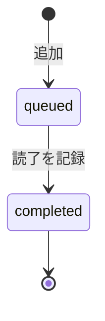

# プロジェクト用語集 (Glossary)

## 概要

このドキュメントは、HRPortfolioプロジェクトで使用される用語の定義を管理します。

**更新日**: 2026-03-24

---

## ドメイン用語

### スキルマップ

**定義**: HRプロフェッショナルが自分のスキルを3領域18項目で自己評価した結果の全体像。

**説明**: People Analytics・組織開発・戦略人事の3領域にわたるスキルを5段階で評価し、レーダーチャートとスコア一覧で可視化したもの。ユーザーの「現在地」を示す中心概念。

**関連用語**: [スキルフレームワーク](#スキルフレームワーク)、[自己評価スコア](#自己評価スコア)、[ギャップスキル](#ギャップスキル)

**使用例**:
- 「スキルマップを更新する」: 自己評価スコアを変更する
- 「スキルマップを公開する」: ポートフォリオとして外部に共有する

**英語表記**: Skill Map
**データモデル**: `src/types/skill.ts`

---

### スキルフレームワーク

**定義**: HRプロフェッショナルが習得すべきスキルを体系化した3領域18スキルの定義一覧。

**説明**: AIHR・SHRMの外部資格基準と転職市場の求人要件を統合して定義。コード定数（`SKILL_FRAMEWORK.ts`）で管理するため、DBマイグレーションなしに領域追加が可能。

**3領域の定義**:

| 領域 | コードキー | 説明 | スキル数 |
|---|---|---|---|
| People Analytics | `people_analytics` | データ分析・HRIS・予測技術に関するスキル | 8 |
| 組織開発（OD） | `organizational_development` | 組織診断・変革・ファシリテーションに関するスキル | 6 |
| 戦略人事 | `strategic_hr` | People Analytics × ODの掛け合わせゾーン | 4 |

**実装箇所**: `src/constants/SKILL_FRAMEWORK.ts`
**英語表記**: Skill Framework

---

### 自己評価スコア

**定義**: 各スキルに対してユーザーが自己申告する1〜5の習熟度スコア。

**スコア定義**:

| スコア | 意味 |
|---|---|
| 1 | 知らない / 未経験 |
| 2 | 知っている（概念理解） |
| 3 | 補助的にできる（経験あり・一人では不完全） |
| 4 | 独力でできる（実務経験あり） |
| 5 | 教えられる / 応用できる（専門性あり） |

**関連用語**: [ギャップスキル](#ギャップスキル)
**データモデル**: `SkillAssessment.score`

---

### ギャップスキル

**定義**: 自己評価スコアが2以下のスキル。優先的に学習すべき対象として扱われる。

**説明**: ギャップスキルは情報フィードの「おすすめ記事」スコアリングに使用される。ギャップが大きいスキルに関連する記事が優先的に表示される。

**関連用語**: [スキルマップ](#スキルマップ)、[おすすめ記事スコア](#おすすめ記事スコア)
**実装箇所**: `src/services/SkillService.ts` - `getGapSkills()`

---

### 学習キュー

**定義**: ユーザーが「積読」または「読了」として管理する記事・書籍の一覧。

**説明**: 情報フィードや書籍検索から追加できる。各アイテムには関連スキルを紐付けることで、学習とスキル成長の根拠として蓄積される。

**ステータス定義**:

| ステータス | 意味 | 遷移条件 |
|---|---|---|
| `queued` | 積読（未読） | 記事・書籍を追加した時点 |
| `completed` | 読了 | ユーザーが読了を記録した時点 |



**関連用語**: [学習ログ](#学習ログ)
**データモデル**: `LearningItem`

---

### 学習ログ

**定義**: ユーザーが読了した記事・書籍の累積記録。スキルポートフォリオの根拠データとなる。

**説明**: 読了件数・振り返りメモ数がポートフォリオに表示され、スキル評価の裏付けとして機能する。「記録するだけで証明になる」設計。

**実装上の対応**: `LearningItem` テーブルの `status: 'completed'` のレコードが学習ログに相当する（`status: 'queued'` は積読中）

**関連用語**: [学習キュー](#学習キュー)、[スキルポートフォリオ](#スキルポートフォリオ)

---

### スキルポートフォリオ

**定義**: スキルマップ・学習ログ・読書記録を1ページにまとめた個人振り返りダッシュボード。

**説明**: 自分の成長を俯瞰するための個人ツール。ここで言語化したスキルをCVや面接でのアピールに活用することを想定している。外部公開・URL共有は主目的ではない。

**表示内容**:
- スキルレーダーチャート（領域平均）
- 読了書籍数 / 記事既読数 / 振り返りメモ数
- 直近3ヶ月の注力スキル（Top3）

**実装箇所**: `/portfolio`（認証必須・本人のみ閲覧）

---

### 情報フィード

**定義**: HR関連の複数ソースから自動収集された最新記事のキュレーション一覧。

**説明**: 毎日06:00 JSTにCronジョブで更新される。カテゴリはPeople Analytics・OD・HR Tech・国内HR・経営学・労働経済学・学術論文（グローバル）・学術論文（国内）・HRコンサル（グローバル）・HRコンサル（国内）の10種類。

**関連用語**: [おすすめ記事スコア](#おすすめ記事スコア)、[記事ソース](#記事ソース)
**実装箇所**: `src/services/FeedService.ts`

---

### おすすめ記事スコア

**定義**: ユーザーのギャップスキルと記事の関連度・鮮度から算出する優先表示スコア（0〜100点）。

**計算式**:
```
おすすめスコア = (ギャップスコア × 0.7) + (鮮度スコア × 0.3)

ギャップスコア = (5 - ユーザーのスキルスコア) × 25
鮮度スコア    = 公開1日以内:100点 / 3日以内:80点 / 7日以内:60点 / 14日以内:40点 / それ以上:20点
```

**実装箇所**: `src/services/FeedService.ts` - `calcArticleScore()`

---

### 記事ソース

**定義**: RSSフィードで記事を収集する情報源の設定。

**説明**: `ARTICLE_SOURCES.ts` でコード管理。カテゴリ・名称・RSSフィードURLを持つ。

**実装箇所**: `src/constants/ARTICLE_SOURCES.ts`

---

### トレンドレーダー

**定義**: HR領域で注目されているキーワードTop10を月次で更新・表示し、自分のスキルマップとのギャップを示す機能。

**説明**: 毎月1日 08:00 JSTにCron Jobが起動し、直近2ヶ月分の記事データをClaude APIで分析してトレンドキーワードを自動生成する（ローリングウィンドウ方式）。

**関連用語**: [スキルマップ](#スキルマップ)
**実装箇所**: `src/services/TrendService.ts`

---

### 記事難易度タグ

**定義**: 各記事の難易度を4段階で分類するタグ。Claude APIによりスキルタグと同時に自動付与される。

| 難易度 | 対象スキルレベル | 記事の特徴 |
|---|---|---|
| 入門（beginner） | 1〜2 | 概念解説・用語紹介・ブログ記事 |
| 実践（practical） | 2〜3 | 実務事例・How-to・ケーススタディ |
| 応用（advanced） | 3〜4 | 深掘り分析・研究紹介・専門メディア |
| 専門（expert） | 4〜5 | 学術論文・最新研究・エキスパート論考 |

**実装箇所**: `src/types/article.ts` - `ArticleDifficulty`

---

### 学習サマリ & スキル言語化アーカイブ

**定義**: 一定期間の学習ログ・読書記録をClaude APIで処理し、「自分はXができる」という一人称の言語でスキルを言語化したサマリと、その履歴アーカイブ（P2機能）。

**説明**: 月次・四半期ごとに自動生成され、ユーザーが編集・確定したものがアーカイブに蓄積される。アーカイブの時系列参照により成長の変化を実感できる。公開プロフィールへの任意掲載も可能。

**優先度**: P2（将来対応）
**関連用語**: [学習ログ](#学習ログ)、[スキルポートフォリオ](#スキルポートフォリオ)

---

### 自己評価ガイド指標

**定義**: 各スキルの評価レベルに対応した具体的な行動・経験の目安（P2機能）。

**説明**: スキル評価時にポップアップで参照でき、「業務経験」「できること」「アウトプット例」の3軸で記述される。自己評価のブレを減らし、より正確な現在地把握を支援する。

**優先度**: P2（将来対応）
**関連用語**: [自己評価スコア](#自己評価スコア)、[スキルマップ](#スキルマップ)

---

### HR専門チャットボット

**定義**: 労働法・法改正・HR専門知識に特化したRAG構成のチャットボット（P2機能）。

**説明**: Claude API + ベクトル検索（pgvector または Pinecone）を組み合わせ、e-Gov法令API・厚労省通達・HR専門資料を参照した回答を生成する。トライアルは登録から7日間無制限。以降はPAY.JPによる月額課金制。

**データソース（RAG）**: e-Gov法令API・厚労省通達・AIHR/SHRM等の専門資料
**優先度**: P2（将来対応）
**関連用語**: [Claude API](#claude-api)

---

### スキルベース書籍データベース

**定義**: HR名著に対して「どのスキルが・どのレベルから伸びるか」をHRプロフェッショナルの回答から集積した書籍評価データベース。

**説明**: Amazonレビューが主観的な満足度を蓄積するのに対し、スキルベース書籍DBはHRプロの機能的評価（スキル×レベル×効果）を蓄積する。フェーズ1はClaude APIによる事前タグ付けで即日提供し、ユーザー回答が10件以上蓄積した書籍から順次クラウドソーシングデータに切り替わる。

**実装箇所**: `src/constants/CLASSIC_BOOKS.ts`（初期名著リスト）、`src/services/BookService.ts`

---

### 毎日書籍アンケート

**定義**: ダッシュボードに毎日1冊の名著を提示し、「読んだ・積読に追加・スキップ」の回答を収集する機能。

**説明**: 「読んだ」回答時に紐付けスキルと当時のスキルレベルを記録することで、スキルベース書籍DBの精度を向上させる。回答自体が「自分がまだ読んでいないHR名著」の可視化にもなる。

**データモデル**: `BookSurveyResponse`

---

### 書籍スキルタグ

**定義**: 書籍に対してユーザーが「この本を読んでこのスキルが伸びた」と回答した集計結果。

**説明**: Claude APIが事前付与した `claudeSkillTags`（フェーズ1）と、ユーザー回答を集計した `BookSkillTag`（回答数10件以上で切り替え）の2種類が存在する。書籍のスキルギャップマッチングに使用される。

**データモデル**: `Book.claudeSkillTags`、`BookSkillTag`

---

### 棚卸しリマインダー

**定義**: 最後のスキル評価から90日（3ヶ月）以上経過した場合に表示する更新促進通知。

**実装箇所**: `src/services/SkillService.ts` - `needsReview()`

---

### 通知ログ（NotificationLog）

**定義**: 棚卸しリマインダーの送信状態と成長実感アンケートの回答状態を記録するエンティティ。

**説明**: ユーザーごとに通知の送信済み・アンケート回答済みを管理し、同じユーザーへの重複通知を防ぐ。

**type の種類**:

| type | 説明 |
|---|---|
| `review_reminder` | 棚卸しリマインダー（メール + ダッシュボードバナー） |
| `survey` | 成長実感アンケート表示（スキルマップ完成から90日後） |

**データモデル**: `NotificationLog`
**実装箇所**: `src/services/NotificationService.ts`

---

## 略語・頭字語

### HR

**正式名称**: Human Resources

**意味**: 人事・人的資源管理。本プロダクトの主要ターゲット領域。

---

### PA（People Analytics）

**正式名称**: People Analytics

**意味**: データ分析をHR業務に活用する専門分野。離職予測・エンゲージメント分析・ワークフォースプランニング等を含む。

**本プロジェクトでの使用**: スキルフレームワークの第1領域。`people_analytics` カテゴリ。

---

### OD（組織開発）

**正式名称**: Organization Development

**意味**: 組織の有効性向上を目的とした計画的な変革・介入活動。

**本プロジェクトでの使用**: スキルフレームワークの第2領域。`organizational_development` カテゴリ。

---

### HRIS

**正式名称**: Human Resource Information System

**意味**: 人事情報管理システム。WorkdayやSAPなどが代表例。

**本プロジェクトでの使用**: スキルフレームワーク「HRIS・HRテクノロジー活用」スキルのスコープ。

---

### SHRM

**正式名称**: Society for Human Resource Management

**意味**: 米国の人事管理専門家協会。SHRM-CPなどの資格を発行する。

**本プロジェクトでの使用**: スキルフレームワーク定義の参照元のひとつ。

---

### AIHR

**正式名称**: Academy to Innovate HR

**意味**: HR分野の教育・認定機関。People Analyticsなどの専門コースを提供。

**本プロジェクトでの使用**: スキルフレームワーク定義の参照元、かつ情報ソースのひとつ。

---

### ISR（Incremental Static Regeneration）

**正式名称**: Incremental Static Regeneration

**意味**: Next.jsの機能。静的ページを一定間隔でバックグラウンド更新する仕組み。

**本プロジェクトでの使用**: 情報フィードページのキャッシュ更新（1時間ごと）に使用。

---

## 技術用語

### Prisma

**定義**: Node.js/TypeScript向けのORM（オブジェクト関係マッピング）ライブラリ。

**公式サイト**: https://www.prisma.io/

**本プロジェクトでの用途**: PostgreSQLへのすべてのDB操作をPrisma経由で行う。型安全なクエリ生成とマイグレーション管理。

**バージョン**: 6.x
**関連ドキュメント**: [アーキテクチャ設計書](./architecture.md)、[リポジトリ構造定義書](./repository-structure.md)
**設定ファイル**: `prisma/schema.prisma`

---

### NextAuth.js

**定義**: Next.js向けの認証ライブラリ。Google・GitHubなどのOAuthプロバイダーに対応。

**本プロジェクトでの用途**: ユーザー認証・セッション管理。HTTP-Only Cookieでセッションを管理し、CSRF攻撃を防止。

**バージョン**: 5.x

---

### Vercel Cron Jobs

**定義**: Vercelが提供するサーバーレス環境でのスケジュール実行機能。

**本プロジェクトでの用途**:
- 記事収集: 毎日06:00 JST（`/api/cron/fetch-articles`）
- 書店ランキング更新: 毎週月曜07:00 JST（`/api/cron/update-book-rankings`）

---

### Resend

**定義**: メール送信に特化したAPIサービス。

**本プロジェクトでの用途**: スキル棚卸しリマインダーメールの送信。最終スキル評価から90日経過したアクティブユーザーに送信する。

**実装箇所**: `src/lib/resend.ts`
**バージョン**: 最新安定版

---

### Upstash Redis

**定義**: サーバーレス環境向けのRedis互換KVストア（Vercel KVの後継サービス）。

**本プロジェクトでの用途**: 楽天ブックスAPI・Amazon PA APIのレスポンスキャッシュ。外部APIのレート制限対策として使用。

**キャッシュ設計**:
- キャッシュキー: `books:search:{クエリハッシュ}` / `books:ranking:{日付}`
- TTL: 書籍検索結果は24時間、週次ランキングは7日間

**実装箇所**: `src/lib/kv.ts`（`@upstash/redis` パッケージを使用）

---

### 楽天ブックスAPI

**定義**: 楽天株式会社が提供する書籍情報・ランキング取得API。

**本プロジェクトでの用途**: 書籍検索・ビジネス書カテゴリのランキング取得。無料・登録制。

**実装箇所**: `src/lib/rakuten.ts`

---

### Amazon PA API

**正式名称**: Amazon Product Advertising API

**定義**: Amazonが提供する商品情報取得API。アソシエイト登録が必要。

**本プロジェクトでの用途**: 書籍検索・書誌情報の補完。楽天で取得できない書籍データをAmazonで補う。ISBNをキーに楽天データとマージ。

**実装箇所**: `src/lib/amazon.ts`

---

### Claude API

**定義**: Anthropicが提供するLLM（大規模言語モデル）API。

**本プロジェクトでの用途**:
- RSSで取得した記事の日本語要約生成（100〜200字）
- 記事へのスキルタグ自動付与
- 記事への難易度タグ自動付与（入門・実践・応用・専門）
- 月次トレンドキーワードの分析・生成

**実装箇所**: `src/lib/claude.ts`

---

## アーキテクチャ用語

### レイヤードアーキテクチャ

**定義**: システムを役割ごとに複数の層に分割し、上位層から下位層への一方向の依存関係を持たせる設計パターン。

**本プロジェクトでの適用**:
```
app/（ページ・APIルート）
    ↓
services/（ビジネスロジック）
    ↓
repositories/（DB操作）
    ↓
lib/（外部接続）
```

**禁止される依存**: `repositories/` → `services/`、`components/` → `services/`

---

### 移行容易性設計

**定義**: 将来のインフラ移行（Vercel → Google Cloud等）を低コストで実現するための設計方針。

**本プロジェクトでの適用**:
- Vercel固有サービスの使用を最小化
- 標準PostgreSQL互換のNeon（サーバーレスPostgreSQL）を使用
- 環境変数で接続先を切り替えられる設計

**移行判断の目安**: 月間アクティブユーザー5,000人超 / 月額インフラコスト$1,000超

---

## ステータス・状態

### 学習アイテムステータス

| ステータス | 意味 | 遷移条件 |
|---|---|---|
| `queued` | 積読（未読） | 記事・書籍を学習キューに追加した時 |
| `completed` | 読了 | ユーザーが読了を記録した時 |

### ポートフォリオ公開状態

| 状態 | 意味 |
|---|---|
| `portfolioPublic: false` | 非公開（デフォルト）。本人のみ閲覧可 |
| `portfolioPublic: true` | 公開中。URLを知っていれば誰でも閲覧可 |

---

## エラー・例外

### ValidationError

**クラス名**: `ValidationError`
**発生条件**: ユーザー入力がバリデーションルールに違反した場合
**対処方法**: エラーメッセージに従って入力値を修正する
**ログレベル**: WARN

```typescript
throw new ValidationError('スコアは1〜5の整数で入力してください', 'score', value);
```

---

### NotFoundError

**クラス名**: `NotFoundError`
**発生条件**: 指定されたIDのリソースが存在しない場合
**対処方法**: 対象リソースが削除されていないか確認する
**ログレベル**: WARN

```typescript
throw new NotFoundError('User', userId);
```

---

### ExternalApiError

**クラス名**: `ExternalApiError`
**発生条件**: 楽天ブックスAPI・Amazon PA API・Claude APIの呼び出しに失敗した場合
**対処方法**: しばらく待って再試行する。継続する場合はAPIキーや接続設定を確認する
**ログレベル**: ERROR

```typescript
throw new ExternalApiError('rakuten', originalError);
throw new ExternalApiError('amazon', originalError);
throw new ExternalApiError('claude', originalError);
```

---

## 索引

### あ行
- [おすすめ記事スコア](#おすすめ記事スコア) - ドメイン用語

### か行
- [学習キュー](#学習キュー) - ドメイン用語
- [学習サマリ & スキル言語化アーカイブ](#学習サマリ--スキル言語化アーカイブ) - ドメイン用語（P2）
- [学習ログ](#学習ログ) - ドメイン用語
- [記事ソース](#記事ソース) - ドメイン用語
- [記事難易度タグ](#記事難易度タグ) - ドメイン用語

### さ行
- [自己評価スコア](#自己評価スコア) - ドメイン用語
- [自己評価ガイド指標](#自己評価ガイド指標) - ドメイン用語（P2）
- [情報フィード](#情報フィード) - ドメイン用語
- [スキルベース書籍データベース](#スキルベース書籍データベース) - ドメイン用語
- [スキルフレームワーク](#スキルフレームワーク) - ドメイン用語
- [スキルポートフォリオ](#スキルポートフォリオ) - ドメイン用語
- [スキルマップ](#スキルマップ) - ドメイン用語
- [書籍スキルタグ](#書籍スキルタグ) - ドメイン用語


### た行
- [棚卸しリマインダー](#棚卸しリマインダー) - ドメイン用語
- [通知ログ（NotificationLog）](#通知ログnotificationlog) - ドメイン用語
- [トレンドレーダー](#トレンドレーダー) - ドメイン用語
- [毎日書籍アンケート](#毎日書籍アンケート) - ドメイン用語

### は行
- [HR専門チャットボット](#hr専門チャットボット) - ドメイン用語（P2）

### ま行
- [移行容易性設計](#移行容易性設計) - アーキテクチャ用語

### ら行
- [楽天ブックスAPI](#楽天ブックスapi) - 技術用語
- [レイヤードアーキテクチャ](#レイヤードアーキテクチャ) - アーキテクチャ用語

### A-Z
- [AIHR](#aihr) - 略語
- [Amazon PA API](#amazon-pa-api) - 技術用語
- [Claude API](#claude-api) - 技術用語
- [ExternalApiError](#externalapierror) - エラー
- [HR](#hr) - 略語
- [HRIS](#hris) - 略語
- [ISR](#isr（incremental-static-regeneration）) - 略語
- [NextAuth.js](#nextauthjs) - 技術用語
- [NotFoundError](#notfounderror) - エラー
- [OD](#od（組織開発）) - 略語
- [PA](#pa（people-analytics）) - 略語
- [Prisma](#prisma) - 技術用語
- [SHRM](#shrm) - 略語
- [ValidationError](#validationerror) - エラー
- [Resend](#resend) - 技術用語
- [Upstash Redis](#upstash-redis) - 技術用語
- [Vercel Cron Jobs](#vercel-cron-jobs) - 技術用語
